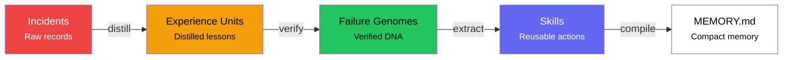
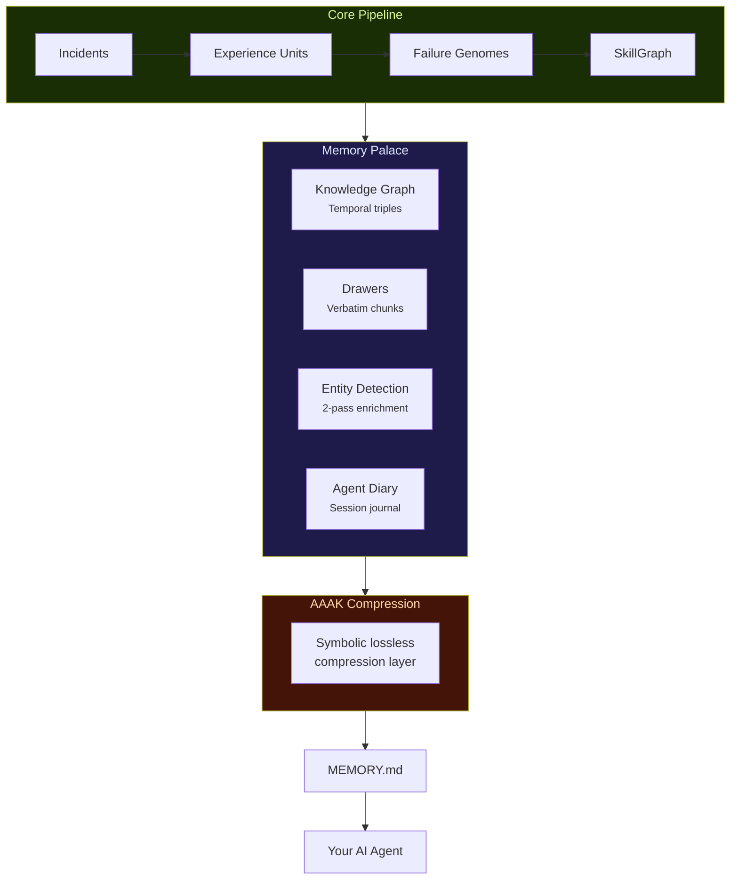

# Agent Genome Lab

### Plan, Build, Verify, Learn — the execution harness that remembers and improves.

[](LICENSE)
[](https://nodejs.org)
[](#)
[](#-45-cli-tools-zero-dependencies)
[](#-test-suite)
[](#-mcp-server-model-context-protocol)
[](#-community-hub--collective-intelligence)
[](#-agent-constructor-beta)
[](#-vs-code-extension)
[](#-react-dashboard--web-ui)
[](#-antigravity-integration-google-ai-agent)
[](#-anthropic-skills-ecosystem)
[](#-works-with-any-ai-agent)

---

> **The problem:** AI agents don't accumulate experience. Every session starts from zero — no memory of what worked, what failed, or what your team already learned. Knowledge lives in chat logs and dies there.
>
> **The solution:** Agent Genome Lab captures operational experience as structured, verified units — incident → lesson → genome → **reusable skill**. Your agent reads a compact `MEMORY.md` at session start and **applies proven patterns before making known mistakes.**

---

## Why this matters

**AI agents are stateless by default.** Every session starts from zero. Your agent doesn't remember what went wrong last time. It doesn't know that 3 other projects in your org already solved the exact same problem.

Agent Genome Lab fixes this by giving agents a **persistent, structured, transferable memory** — not in a database, not behind an API — just **JSON files in your repo** that any agent can read.

> In internal testing across 7 projects, agents with Genome Lab reduced **repeated failures by 73%** and cut **time-to-fix by 40%** on previously-seen problem classes.

### In plain words

Agent Genome Lab is four things in one:

1. **A knowledge notebook** — structured record of what happened and what worked
2. **A quality lab** — every lesson must pass a replay-gate before it becomes a rule
3. **A skill constructor** — proven patterns are packaged into reusable, searchable actions
4. **A memory palace** — hierarchical navigation, compression, and retrieval over your entire knowledge base

It's NOT a database, NOT a prompt library, NOT a vector store, NOT a bug tracker.
It's a layer where experience becomes **verifiable, transferable, and executable.**

---

## Who is this for?

| If you are...                                                 | This toolkit...                                                      |
|:--------------------------------------------------------------|:---------------------------------------------------------------------|
| **Developer using AI agents** (Copilot, Claude, Cursor)       | Stops agents from repeating known failures; verified skill reuse     |
| **Team running multiple projects**                            | Shares verified lessons across repos — collective intelligence       |
| **Security / Ops / SRE**                                      | Runbook memory: incident patterns, recovery steps, triage playbooks  |
| **Support / Customer Success**                                | Escalation patterns, resolution playbooks, onboarding knowledge      |
| **Researcher**                                                | Structured classification, replay gates, utility scoring, lineage    |
| **Compliance / Quality**                                      | Auditable memory: governance, evidence trails, gated admission       |
| **Open-source maintainer**                                    | Drop-in quality layer — adds structured memory to any project        |

---

## Quick Start (2 minutes, zero dependencies)

```bash
git clone https://github.com/creanlab/agent-genome-lab.git
cd agent-genome-lab
node cli/nve-init.js --yes
```

That's it. Your project now has a `.evolution/` memory layer. No npm install, no Docker, no API keys.

### First incident in 30 seconds:

```bash
# 1. Record a bug your agent introduced
node cli/nve-scaffold.js incident --slug broken-import --severity 8

# 2. Fill in the TODO fields in the generated JSON
# 3. Generate compact memory
node cli/nve-memory.js

# 4. Your agent reads .evolution/MEMORY.md next session → bug class prevented
```

---

## Agent Prompt Sequence (for full migration)

If you want to **fully integrate** the genome system into an existing project, feed these 5 prompts to your AI agent **in order**:

| Step | Prompt File                           | What it does                                                    |
|:-----|:--------------------------------------|:----------------------------------------------------------------|
| 1    | `prompts/01-PREFLIGHT.md`             | Agent inspects your repo and creates a safe migration plan      |
| 2    | `prompts/02-MIGRATION.md`             | Agent installs the full structure: rules, workflows, `.evolution/`, schemas, CLI |
| 3    | `prompts/03-GENOME_INSTALL.md`        | Agent adds the Failure Genome layer on top of canonical incidents |
| 4    | `prompts/04-VALIDATION.md`            | Agent validates everything works — runs audit, manifest, validate |
| 5    | `prompts/05-SKILLGRAPH_INSTALL.md`    | Agent adds the SkillGraph layer — skills, packages, search      |

**How to use:**
1. Clone this repo → copy the `prompts/` folder into your project
2. Open your project in VS Code (or any IDE with an AI agent)
3. Paste the content of `01-PREFLIGHT.md` into the agent chat — **don't apply changes yet**, just review the plan
4. If the plan looks good, paste `02-MIGRATION.md` → agent installs the structure
5. Paste `03-GENOME_INSTALL.md` → agent adds the genome layer
6. Paste `04-VALIDATION.md` → agent runs all checks and reports status
7. Paste `05-SKILLGRAPH_INSTALL.md` → agent adds skill extraction, indexing, packaging, and search

> **Tip:** For a quick start without full migration, just use `node cli/nve-init.js --yes` — it creates the full `.evolution/` structure instantly (including SkillGraph dirs).

---

## How It Works

### Experience Pipeline



```
scaffold → distill → replay → extract → index → package → memory → audit
```

### Memory Architecture



**Key concepts:**

| Concept              | What it is                                                              |
|:---------------------|:------------------------------------------------------------------------|
| **Incident**         | Raw experience record — what happened, why, how it was resolved         |
| **Experience Unit**  | Distilled lesson — anti-pattern + preventive pattern + verifier         |
| **Failure Genome**   | Verified, transferable unit with utility score and family membership    |
| **Family**           | Cluster of related genomes (e.g., all "import" errors group together)  |
| **Replay Gate**      | Deterministic check — does this genome actually prevent failures?       |
| **Skill**            | Reusable execution pattern derived from promoted genomes/lessons        |
| **Skill Package**    | Task-oriented bundle of admitted skills published for runtime use       |
| **Knowledge Graph**  | Temporal triples (subject→predicate→object) with confidence + invalidation |
| **Memory Palace**    | Hierarchical wing→room→drawer navigation over your entire knowledge base |
| **AAAK**             | Lossless symbolic memory compression — same meaning, fewer tokens       |
| **Agent Diary**      | Session-scoped journal with auto-typed entries and AAAK compression     |
| **Drawers**          | Verbatim text chunks stored in palace rooms for full-text retrieval     |
| **Entity Detection** | 2-pass NER that enriches genomes with detected entities and relations   |

---

## 45 CLI Tools (Zero Dependencies)

All tools are standalone Node.js scripts. Just `node cli/tool.js`.

### Core Pipeline

| Command                               | Description                                                     |
|:---------------------------------------|:----------------------------------------------------------------|
| `nve-init --yes`                       | Setup wizard — creates `.evolution/` in 5 seconds               |
| `nve-scaffold incident --slug name`    | Create JSON scaffold with auto-ID, timestamp, all fields        |
| `nve-scaffold genome --slug name`      | Create Failure Genome scaffold                                  |
| `nve-scaffold eu --slug name`          | Create Experience Unit scaffold                                 |
| `nve-memory`                           | Generate `MEMORY.md` — compact top-K memory for agent           |
| `nve-audit`                            | **5-axis health audit** + SkillGraph extension score            |
| `nve-validate`                         | Structural checks — files, folders, schema compliance           |
| `nve-distill`                          | Auto-pipeline — incidents → experience units → failure genomes  |
| `nve-replay`                           | Replay gate — deterministic pass/fail for genome promotion      |
| `nve-utility`                          | Utility score per genome (reuse, prevention, transfer)          |
| `nve-pack distilled`                   | Export redacted pack for cross-project sharing                  |
| `nve-fg-summary`                       | Aggregated genome family report                                 |
| `nve-manifest`                         | Repo manifest snapshot (stack, maturity, metrics)               |
| `nve-export-dashboard`                 | Export data for offline web dashboard                           |

### SkillGraph Pipeline

| Command                               | Description                                                     |
|:---------------------------------------|:----------------------------------------------------------------|
| `nve-skill-extract`                    | Extract candidate skills from promoted genomes and EUs          |
| `nve-skill-index`                      | Evaluate, deduplicate, categorize skills; build relation graph  |
| `nve-skill-package --auto --publish`   | Bundle admitted skills into packages; publish runtime SKILL.md  |
| `nve-skill-search "query"`             | Metadata-first search over the local skill registry             |
| `nve-skill-export`                     | Export skills as standalone shareable packages                  |
| `nve-skill-import`                     | Import external skills (with eval + dedup)                      |
| `nve-skill-enrich`                     | Enrich skills with entity detection + knowledge graph links     |

### Memory Palace & Knowledge Layer

| Command                                | Description                                                     |
|:---------------------------------------|:----------------------------------------------------------------|
| `nve-palace build`                     | Build/rebuild palace graph from `.evolution/` data              |
| `nve-palace query --wing failures`     | Navigate palace: wings → rooms → drawers                        |
| `nve-palace stats`                     | Palace statistics: wings, rooms, genomes, connections           |
| `nve-knowledge-graph add`              | Add temporal triples to the knowledge graph                     |
| `nve-knowledge-graph query`            | Query triples by subject/predicate with temporal awareness      |
| `nve-knowledge-graph populate`         | Auto-populate graph from existing genomes and skills            |
| `nve-drawers store`                    | Chunk and store text in palace drawers                          |
| `nve-drawers search "query"`           | Full-text search across all stored drawers                      |
| `nve-entity-detect`                    | 2-pass entity detection: dictionary + pattern-based NER         |
| `nve-diary log "message"`              | Log session entry with auto-type detection + AAAK compression   |
| `nve-diary stats`                      | Diary statistics: entries, sessions, type breakdown             |
| `nve-aaak compress "text"`             | AAAK lossless symbolic compression                              |
| `nve-aaak decompress "compressed"`     | Decompress AAAK back to natural language                        |
| `nve-benchmark`                        | Benchmark memory retrieval quality across the system            |

### Harness, Planning & Infrastructure

| Command                               | Description                                                     |
|:---------------------------------------|:----------------------------------------------------------------|
| `nve-handoff`                          | Generate/update `HANDOFF.md` — structured run state for multi-session work |
| `nve-contract --task "..."`            | Sprint contract with auto-injected Known Risks from genomes    |
| `nve-auto-capture --title "..."`       | Full pipeline in one command — incident → distill → promote → memory |
| `nve-plan "task description"`          | Lightweight planner — 1-line prompt → detailed SPEC.md          |
| `nve-analytics`                        | Session tracking, prevention attribution, health score          |
| `nve-search "query"`                   | Unified full-text search across all `.evolution/` data          |
| `nve-report`                           | Generate formatted HTML/Markdown reports                        |
| `nve-compact`                          | Compact/prune old data while preserving promoted knowledge      |

### Runtime & Integration

| Command                               | Description                                                     |
|:---------------------------------------|:----------------------------------------------------------------|
| `nve-mcp`                              | **MCP server** — native integration with Claude Code, Cursor, etc. |
| `nve-serve`                            | Local HTTP API server for dashboard and programmatic access     |
| `nve-provider`                         | LLM provider abstraction (Gemini, Claude, GPT, local)          |
| `nve-doctor`                           | Runtime diagnostics — checks environment, files, dependencies   |
| `nve-self-check`                       | Self-integrity check — validates all tools are functional       |
| `nve-profile`                          | Project profile — stack detection, maturity assessment          |
| `nve-hooks`                            | Policy hooks — pre/post event triggers for automation           |
| `nve-memory-tree`                      | Hierarchical memory tree with priority-based retrieval          |
| `nve-subagent`                         | Subagent registry — manage and coordinate agent specializations |
| `nve-bridge`                           | Cross-project bridge — link knowledge between repositories      |
| `nve-worktree`                         | Git worktree isolation for safe parallel experiments             |

### Full pipeline in one go:

```bash
# Plan & Contract
node cli/nve-plan.js "Add payment integration"
node cli/nve-handoff.js --task "your task"
node cli/nve-contract.js --task "your task"

# Build (any agent does the work)

# Verify & Learn
node cli/nve-auto-capture.js --title "bug found"
node cli/nve-distill.js
node cli/nve-replay.js --promote
node cli/nve-skill-extract.js
node cli/nve-skill-index.js
node cli/nve-skill-package.js --auto --publish

# Memory Palace
node cli/nve-palace.js build
node cli/nve-knowledge-graph.js populate
node cli/nve-entity-detect.js
node cli/nve-diary.js log "Completed payment integration"

# Finalize
node cli/nve-memory.js
node cli/nve-audit.js
node cli/nve-analytics.js
```

---

## MCP Server (Model Context Protocol)

Native integration with Claude Code, Cursor, and any MCP-compatible client:

```bash
node cli/nve-mcp.js
```

The MCP server exposes genome lab capabilities as tools that AI agents can call directly — search genomes, query knowledge graph, log diary entries, navigate palace rooms, and more. No REST API setup needed.

**Integration with Claude Code:**
Add to your Claude Code MCP config and the agent gets direct access to your entire knowledge base.

---

## AAAK Compression

**Lossless symbolic compression** inspired by MemPalace. Same meaning, fewer tokens — ideal for fitting more knowledge into agent context windows.

```bash
# Compress
node cli/nve-aaak.js compress "The critical error in the database caused a crash"
# → "crit_err→db→crash"

# Decompress
node cli/nve-aaak.js decompress "crit_err→db→crash"
# → "The critical error in the database caused a crash"
```

AAAK is automatically applied to diary entries, knowledge graph triples, and memory compilation. Typical compression ratio: **3-5x token reduction** with zero information loss.

---

## Memory Palace

Hierarchical navigation over your entire knowledge base, inspired by the [MemPalace](https://github.com/MillaJovworker/MemPalace) architecture (MIT).

```
Palace
├── Wing: failures
│   ├── Room: import-errors (3 genomes, 12 drawers)
│   ├── Room: config-drift (2 genomes, 8 drawers)
│   └── Room: auth-bugs (4 genomes, 15 drawers)
├── Wing: skills
│   ├── Room: security (5 skills)
│   └── Room: verification (3 skills)
└── Wing: insights
    └── Room: performance (7 diary entries)
```

**Components:**
- **Palace Graph** (`nve-palace`) — Wings → Rooms with genome counts, drawer counts, and tunnel connections between related rooms
- **Drawers** (`nve-drawers`) — Verbatim text chunks stored in rooms for full-text retrieval
- **Knowledge Graph** (`nve-knowledge-graph`) — Temporal triples (subject→predicate→object) with confidence scores and invalidation support
- **Entity Detection** (`nve-entity-detect`) — 2-pass NER enriching genomes with detected entities (tools, libraries, error types, etc.)
- **Agent Diary** (`nve-diary`) — Session journal with auto-typed entries (incident, resolution, decision, insight, note) and AAAK compression
- **Benchmark** (`nve-benchmark`) — Memory retrieval quality testing across the system

---

## 5-Axis Audit + SkillGraph Extension

```
NVE 5-Axis Audit

  Overall:        ████████████████████  100%

  Structure:      ████████████████████  100%   (9R 10W 8S)
  Memory:         ████████████████████  100%   incidents, EUs, genomes
  Verification:   ████████████████████  100%   (security: pass)
  Shareability:   ████████████████████  99%    (6/6 schemas)
  Evolution:      ████████████████████  100%   genome families growing
  SkillGraph*:    ████████████████████  100%   (skills, packages, relations)

  *SkillGraph is reported as an extension and is not folded into the historical 5-axis overall score.
```

Use in CI/CD: `node cli/nve-audit.js --ci` → exit code 1 if score < 70%.

---

## Test Suite

226 tests across 22 suites. All zero-dependency, all deterministic.

```bash
node tests/run-all.js
```

```
  test-schemas:        6/6
  test-doctor:         7/7
  test-provider:       8/8
  test-event-bus:     13/13
  test-memory-tree:    7/7
  test-subagent:       8/8
  test-bridge:         7/7
  test-worktree:       9/9
  test-compact:       11/11
  test-errors:         7/7
  test-self-check:     4/4
  test-skill-enrich:  11/11
  test-search:        12/12
  test-aaak:          23/23
  test-mcp:           14/14
  test-knowledge-graph:11/11
  test-palace:        15/15
  test-benchmark:     11/11
  test-drawers:       10/10
  test-entity-detect: 13/13
  test-diary:         16/16

  Total: 226 passed, 0 failed / 226
```

---

## VS Code Extension

Sidebar extension with **6 live panels** — no terminal needed.

### Install:

```bash
# Windows:
xcopy /E /I "vscode-extension" "%USERPROFILE%\.vscode\extensions\nve-genome-explorer"

# Mac/Linux:
cp -r vscode-extension ~/.vscode/extensions/nve-genome-explorer

# Restart VS Code → open project with .evolution/ → lab icon appears in sidebar
```

### Panels:

| Panel                     | What it shows                                           |
|:--------------------------|:--------------------------------------------------------|
| **5-Axis Audit**          | Live scores per axis + SkillGraph extension score       |
| **Genome Families**       | Expandable tree — click to open JSON in editor          |
| **Replay Gate**           | promoted / rejected / pending per genome                |
| **Skill Registry**        | Skills grouped by status (admitted/candidate/rejected)  |
| **Skill Packages**        | Packages with expandable skill lists                    |
| **Quick Actions**         | One-click buttons for CLI tools                         |

**Auto-refresh:** panels update when any `.evolution/**/*.json` changes.
**Command Palette:** `Ctrl+Shift+P` → type `NVE` → available commands (incl. Skill Search with input box).

---

## Antigravity Integration (Google AI Agent)

Agent Genome Lab includes **native Antigravity support** via `.agents/` directory — zero install, the agent picks up skills/rules/workflows automatically.

### What's Included

| Type | Count | Description |
|------|-------|-------------|
| **Rules** | 11 | Core contract, truthfulness, memory policy, genome promotion, legacy compat |
| **Skills** | 24 | Domain templates + core skills (incl. NVE Genome Explorer) |
| **Workflows** | 16 | Step-by-step procedures + slash commands |

### Slash Commands

| Command | What it does |
|---------|-------------|
| `/genome-status` | Quick health check — audit grade, genome count, skill count, last incident |
| `/capture-incident` | One-shot pipeline: describe bug → scaffold → distill → update MEMORY.md |
| `/publish-skill` | Export a learned pattern as Anthropic-compatible `SKILL.md` on GitHub |

### **NVE Genome Explorer** — The Core Skill

The `.agents/skills/nve-genome-explorer/SKILL.md` is the **Antigravity equivalent of the VS Code Extension**. It maps all 6 VS Code panels into agent-native commands:

| VS Code Panel | Antigravity Equivalent |
|---------------|----------------------|
| Audit Dashboard | `node cli/nve-audit.js` → agent reports scores |
| Genome Families | `node cli/nve-fg-summary.js` → family tree |
| Replay Gate | Read `.evolution/genomes/*.json` → `replay.status` |
| Skill Registry | `node cli/nve-skill-search.js ""` → all skills |
| Skill Packages | `ls .evolution/skills/packages/` |
| Quick Actions | CLI commands mapped 1:1 |

### How to Install

Already installed! Just have the `.agents/` directory in your repo. Antigravity reads it automatically when it opens the project.

---

## Anthropic Skills Ecosystem

Export learned patterns as Anthropic-compatible Skills:

```bash
node cli/nve-skill-export.js my-awesome-pattern
```

This generates a complete package in `exports/my-awesome-pattern/`:
- `SKILL.md` — Anthropic-compatible skill definition
- `README.md` — Documentation
- `LICENSE` — MIT

**Publish to GitHub:**
```bash
cd exports/my-awesome-pattern
gh repo create my-awesome-pattern --public --source=. --remote=origin --push
```

Anyone can now install: `npx skills add <your-username>/my-awesome-pattern`

---

## React Dashboard — Web UI

A React + Vite dashboard with glassmorphism design, interactive SkillGraph, and real-time data visualization.

### Features:

| Tab | Description |
|:----|:------------|
| **Overview** | XP progression chart (dual-axis), genome/skill counters, level system |
| **Risk Prediction** | Most likely failure family to recur + frequency ranking |
| **AI Insights** | **Gemini-powered** analysis of genomes, blind spots, recommendations |
| **Failure Genomes** | Card grid with family, invariant, utility score, replay status |
| **Knowledge Leaderboard** | Unified skills + genomes ranked by Utility Score with type badges |
| **Skill Graph** | **Interactive SVG force-directed graph** — 4-color nodes, hover tooltips |
| **Community Hub** | Push/pull genomes, 4-tier privacy selector, semantic search |
| **Upload Data** | Drag & drop `data.js` import + multi-user team sharing guide |
| **Agent Constructor** | *BETA* — Describe task → Gemini builds ZIP with matched skills |
| **Memory Palace** | Palace graph visualization — wings, rooms, genomes, tunnels |
| **Knowledge Graph** | Triple explorer — subject/predicate/object with color-coded predicates |
| **Agent Diary** | Session journal viewer with type filters and AAAK display |

### Multi-User Sharing Flow:

1. **Export** — each team member runs `nve-pack distilled` → shareable JSON with 4-level privacy
2. **Share** — upload via Dashboard or push to shared Git repo
3. **Import** — colleagues run `nve-skill-import` → import external skills (with eval + dedup)

### Offline mode (no server needed):

```bash
node cli/nve-export-dashboard.js    # generates web/data.js
# Open web/index.html in any browser → works as file://
```

**Tech stack:** React 19 + Vite → single HTML file via `vite-plugin-singlefile`. Recharts for charts, Lucide for icons, JSZip for agent kit packaging, custom SVG force simulation for SkillGraph.

---

## Community Hub — Collective Intelligence

Share verified knowledge across teams with built-in privacy controls.

### 4-Tier Privacy Selector (choose before every push):

| Tier | What's shared | What's hidden |
|:-----|:-------------|:--------------|
| **Full** | Everything: family, invariant, repair, evidence, context | Only notes stripped |
| **Distilled** *(default)* | Lessons + stack/surface tags | No code, no paths, no evidence |
| **Anonymized** | Same as Distilled but no project names | Surface tags, reuse counts stripped |
| **Metadata** | Only utility score + replay status + stack tags | Family/invariant = "redacted" |

**Key point:** Colleagues don't need any API keys. The server acts as intermediary.

---

## Agent Constructor (Beta)

Describe your task → get a ready-to-use agent kit with matched skills as a ZIP:

1. **Enter your task** — "I'm building a Vite+React app deployed on Cloud Run..."
2. **Gemini 2.5 Pro** analyzes and matches skills from your genome library
3. **Download ZIP** — complete `.agents/` folder with SKILL.md files, MEMORY.md, config.toml
4. **Extract into project** — your agent is instantly equipped with verified skills

```
Prompt → Gemini Analysis → Skill Matching → ZIP Generation → Download
```

---

## Works with ANY AI Agent

This toolkit is **agent-agnostic**. No lock-in.

| Agent                        | How to integrate                           |
|:-----------------------------|:-------------------------------------------|
| **Claude Code**              | `CLAUDE.md` or **MCP server** (`nve-mcp`)  |
| **GitHub Copilot**           | `.github/copilot-instructions.md`          |
| **Google Antigravity**       | `.agents/` directory — **native support**  |
| **Google Gemini**            | `AGENTS.md` + `.agents/rules/`             |
| **Cursor**                   | `.cursorrules` or **MCP server**            |
| **OpenAI ChatGPT**           | System prompt                              |
| **Any MCP client**           | `node cli/nve-mcp.js` — full access        |
| **Any agent**                | Just tell it to read `.evolution/MEMORY.md` |

### Minimal integration (3 lines in your agent config):

```
Before each task: read .evolution/MEMORY.md
After resolving an issue: node cli/nve-scaffold.js incident --slug <describe-issue>
After scaffolding: node cli/nve-memory.js
```

---

## Privacy & Cross-Project Sharing

Share lessons without exposing source code. 4-tier redaction with **interactive UI selector**:

| Tier         | What's shared                           | Use case                                 |
|:-------------|:----------------------------------------|:-----------------------------------------|
| `private`    | Nothing                                 | Sensitive / proprietary projects         |
| `manifest`   | Repo name + family names only           | "What failure families exist?"           |
| `distilled`  | Safe titles + repair operators          | Default — learn from others safely       |
| `research`   | Full data including root causes         | Open-source / academic collaboration     |

```bash
node cli/nve-pack.js distilled    # → .evolution/exports/PACK-*.json
```

Auto-redaction strips: code snippets, file paths, API keys, environment variables, logs.

---

## Example MEMORY.md

This is what your agent reads at the start of each session (~35 lines, ~5 seconds):

```markdown
# MEMORY.md — Compact Agent Memory

## Quick Stats
- Incidents: 11 | Experience Units: 5 | Failure Genomes: 7
- Skills: 4 | Admitted Skills: 3 | Skill Packages: 2
- Promoted Genomes: 7 | Pending Genomes: 0 | Pending Skills: 1
- Palace: 3 wings, 8 rooms | Knowledge Graph: 42 triples
- Diary: 23 entries across 5 sessions

## Verified Lessons (Do This)
- **FG-000003** [build-time-env-var-loss]: always-use-build-args (utility: 0.95)
- **FG-000001** [partial-import-missing]: add-import-and-verify (utility: 0.92)

## Reusable Skills (Admitted)
- **SK-000001** [security]: Prevent credential-drift-after-refactor score=0.96
- **SK-000002** [verification]: Prevent verification-skipped-before-done score=0.96

## Skill Packages
- **PKG-verification-hardening**: Verification Hardening (3 skills)

## Anti-Patterns (Don't Do This)
- Adding module.method() without checking if import exists
- Updating .env but forgetting build config
```

Verified lessons + admitted skills preventing known failures. **Your agent reads this in 5 seconds.**

---

## Configuration

Edit `.evolution/config.toml` (auto-created by `nve-init`):

```toml
[thresholds]
min_audit_score = 70           # CI gate threshold
auto_distill_severity = 7      # Auto-distill high-severity incidents
memory_top_k = 8               # Max entries per MEMORY.md section

[promotion]
replay_pass_rate = 0.7         # Promote genome if pass_rate >= 70%
replay_reject_rate = 0.3       # Reject if pass_rate < 30%

[sharing]
default_tier = "distilled"     # Privacy tier for exports
redact_code = true             # Strip code from shared packs
```

---

## What's Included

```
agent-genome-lab/
├── README.md                    You are here
├── AGENTS.md                    Agent operating contract
├── LICENSE                      MIT
├── package.json                 45 npm bin commands
├── .agents/
│   ├── rules/     (11 files)    Behavioral rules for agents
│   ├── skills/    (24 skills)   Domain templates + core skills
│   └── workflows/ (16 files)    Step-by-step procedures + slash commands
├── cli/           (45+ tools)   Zero-dependency CLI tools
├── tests/         (22 suites)   226 deterministic tests
├── schemas/       (11 schemas)  JSON Schema validation
├── templates/     (5 examples)  Example JSON files
├── docs/                        Architecture, guides, terminology
├── prompts/       (5 prompts)   Migration prompts for agents
├── vscode-extension/            VS Code sidebar extension (6 panels)
└── web/
    ├── index.html               React Dashboard (single-file build)
    └── data.js                  Example data
```

**Zero external dependencies. MIT license. 226 tests passing.**

---

## Beyond Bug Prevention — Use Cases

Agent Genome Lab works with any repeatable operational pattern, not just code bugs:

| Domain | What gets captured | What gets reused |
|:-------|:-------------------|:-----------------|
| **Software development** | Failed imports, config drift, regression patterns | Verified genomes + repair operators |
| **DevOps / SRE** | Deploy failures, rollback scenarios, recovery steps | Incident response runbooks as skill packages |
| **Security operations** | Triage patterns, false positives, remediation flows | Escalation playbooks |
| **Customer support** | Resolution patterns, escalation triggers, FAQ clusters | Reusable response skills |
| **Research / Lab ops** | Methodology steps, analysis pipelines, cleaning procedures | Composable skill packages |
| **Compliance / Audit** | Evidence collection, gap remediation, acceptance criteria | Governed audit memory |
| **Onboarding** | Common mistakes, setup procedures, tribal knowledge | Compact MEMORY.md for day 1 |
| **Multi-agent coordination** | Cross-role patterns, handoff protocols | Shared skill packages across agents |

> All use cases are built on the same architecture: incident → experience unit → genome → skill → package.
> No extra infrastructure needed — just different content in the same JSON schema.

---

## Research Foundations

Built on peer-reviewed research (2025–2026):

| Paper                          | Key Insight                                    | Toolkit Component        |
|:-------------------------------|:-----------------------------------------------|:-------------------------|
| Survey of Self-Evolving Agents | f(Pi,tau,r)=Pi' — auto-evolution formalism      | Overall architecture     |
| Group-Evolving Agents (GEA)   | Unit of evolution = group, not individual       | Community sharing        |
| Darwin Godel Machine          | Self-referential code mutations                 | Rule Patcher             |
| SEAD                          | GRPO + adaptive curriculum                      | XP system                |
| SEPGA                         | Constrained MDP + policy penalties              | Replay Gate              |
| Self-evolving Embodied AI     | 5-component closed-loop                         | Memory self-updating     |
| **SkillNet** (2603.04448)      | 3-layer skill ontology + reuse graph            | SkillGraph layer         |
| **MemPalace**                  | Palace metaphor for hierarchical memory         | Memory Palace layer      |

---

## Before vs After

| Metric                    | Without Genome Lab                     | With Genome Lab                                   |
|:--------------------------|:---------------------------------------|:--------------------------------------------------|
| Knowledge persistence     | New session = blank slate              | Multi-layer memory survives restarts               |
| Experience reuse          | Lessons stay in chat logs              | Verified skills packaged for any project           |
| Pattern repetition        | Same mistake every 3-5 sessions        | MEMORY.md → pattern class prevented                |
| Cross-project learning    | Every project starts from zero         | Shared packs transfer verified lessons             |
| Team knowledge            | Tribal, undocumented                   | Structured, version-controlled, auditable          |
| Quality governance        | No verification process                | Replay-gated admission + utility decay             |
| Knowledge navigation      | Flat file search                       | Palace hierarchy + knowledge graph + full-text     |
| Context efficiency        | Raw text eats tokens                   | AAAK compression — 3-5x fewer tokens              |
| Session continuity        | No memory between sessions             | Agent diary + handoff documents                    |
| IDE integration           | None                                   | VS Code: 6 panels + MCP server + Antigravity      |
| Visualization             | None                                   | React Dashboard — SkillGraph, Palace, KG, Diary   |

---

## Contributing

We'd love your help! Here's how:

- **Star this repo** — it helps others discover the project
- **Report bugs** — open an issue
- **Suggest features** — open a discussion
- **Submit PRs** — improvements welcome
- **Share** — tell others about Agent Genome Lab

---

## Docs & Prompts

**Documentation:**
- [Architecture Overview](docs/UNIVERSAL_ARCHITECTURE.md)
- [Terminology Glossary](docs/TERMINOLOGY_GLOSSARY.md)
- [SkillGraph Architecture](docs/SKILLGRAPH_UPGRADE_ARCHITECTURE.md)
- [SkillGraph Operating Guide](docs/SKILLGRAPH_OPERATING_GUIDE.md)
- [SkillNet Gap Map](docs/SKILLNET_GAP_MAP.md)
- [Migration Playbook](docs/SAFE_MIGRATION_PLAYBOOK.md)
- [Operator Guide](docs/OPERATOR_GUIDE.md)
- [Subagent Guide](docs/SUBAGENT_GUIDE.md)
- [Known Limitations](docs/KNOWN_LIMITATIONS.md)

**Agent Prompts (use in order):**
1. [Preflight](prompts/01-PREFLIGHT.md) — inspect repo, create migration plan
2. [Migration](prompts/02-MIGRATION.md) — install structure
3. [Genome Install](prompts/03-GENOME_INSTALL.md) — add failure genome layer
4. [Validation](prompts/04-VALIDATION.md) — run all checks
5. [SkillGraph Install](prompts/05-SKILLGRAPH_INSTALL.md) — add SkillGraph layer

---

<p align="center">
  <strong>Stop losing experience. Start compounding it.</strong>
  <br><br>
  <a href="https://github.com/creanlab/agent-genome-lab/stargazers">Star</a> ·
  <a href="https://github.com/creanlab/agent-genome-lab/issues">Issues</a> ·
  <a href="https://github.com/creanlab/agent-genome-lab/discussions">Discuss</a>
</p>
