# 🧬 Evolution Tamagotchi — Research Notes

> **Created**: 2026-03-16 20:15 MSK
> **Purpose**: Академический фундамент для автоэволюции агентов
> **Goal**: Достичь алгоритмов уровня AlphaEvolve DeepMind, визуально обёрнутых в Tamagotchi
> **Backlog**: `backlog_tama.md` → Phase 4 (Research)
> **Status**: 🔬 Active research

---

## 📖 Содержание

1. [Literature Index — 10 Papers](#1-literature-index)
2. [Анализ каждого paper → что нам нужно](#2-analysis)
3. [Инсайты для TAMA](#3-insights)
4. [Mapping: Academic → TAMA implementation](#4-mapping)
5. [Предложения в backlog (ожидают валидации)](#5-proposals)

---

## 1. Literature Index

| # | Paper | Date | Key Concept | Relevance for TAMA |
|---|-------|------|-------------|-------------------|
| P1 | **A Survey of Self-Evolving Agents** | 2025/2026 v4 | Мета-обзор: f(Π,τ,r) = Π' | ⭐⭐⭐ Основа. Таксономия |
| P2 | **Group-Evolving Agents (GEA)** | Feb 2026 | Группа = единица эволюции | ⭐⭐⭐ Multi-user = GEA |
| P3 | **Darwin Gödel Machine (DGM)** | May 2025 v2 | Самореферентный код, архив решений | ⭐⭐⭐ auto-evolution.md = self-ref code |
| P4 | **EvoMAS** | Feb 2026 | Эволюция MAS конфигурации | ⭐⭐ Role/topology evolution |
| P5 | **SEAD** | Feb 2026 | GRPO + curriculum learning | ⭐⭐⭐ Difficulty scaling |
| P6 | **SEPGA** | 2026 | Constrained MDP + policy penalties | ⭐⭐ Enterprise safety |
| P7 | **Self-evolving Embodied AI** | Feb 2026 | 5-компонентный closed-loop | ⭐⭐⭐ Memory self-updating |
| P8 | **EvoConfig** | Jan 2026 | Автоконфигурация среды | ⭐ Environment tuning |
| P9 | **AgentEvolver** | 2025 | Self-Questioning/Navigating/Attributing | ⭐⭐⭐ ADCA-GRPO credit assignment |
| P10 | **Awesome Self-Evolving Agents** | 2026 | Index / Collection | ⭐⭐ Reference hub |

---

## 2. Analysis — Что взять из каждого paper

### P1: Survey of Self-Evolving Agents (arxiv.org/html/2507.21046v4)

**Ключевые формализации:**

Автоэволюция = функция трансформации:
```
f(Π, τ, r) = Π'

где:
  Π = (Γ, {ψ_i}, {C_i}, {W_i})  — agent system (arch, model, context, tools)
  τ = (o_0, a_0, o_1, a_1, ...)  — trajectory
  r = R(s, a, g)                  — feedback/reward
  Π' = evolved system
```

**Таксономия "What to Evolve":**
| Компонент | Что эволюционирует | TAMA mapping |
|-----------|-------------------|-------------|
| Models (ψ) | Веса, fine-tuning | ❌ Мы не тюним модель |
| **Context (C)** | **Промпты, память** | ✅ **auto-evolution.md = evolving prompt!** |
| **Tools (W)** | Доступные инструменты | ✅ Pattern Registry = tool library |
| Architecture (Γ) | Topology, control flow | 🔶 workflow structure |

**Таксономия "When to Evolve":**
| Тип | Описание | TAMA mapping |
|-----|----------|-------------|
| **Intra-test-time** | Во время текущей задачи (ICL, SFT) | ✅ In-context: agent reads journal NOW |
| **Inter-test-time** | Между задачами (RL) | ✅ Between sessions: journal persists |

**Таксономия "How to Evolve":**
| Метод | Описание | TAMA mapping |
|-------|----------|-------------|
| Reward-based | Скалярный reward → optimize | ✅ Impact Score → XP |
| Imitation | Учиться от демонстраций | 🔶 Cross-user patterns |
| **Population-based** | **Множество вариантов параллельно** | ✅ **Multi-user = population** |
| Self-play | Агент играет сам с собой | 🔶 Future: agent vs past-self |

> **💡 INSIGHT-P1**: Наша система формально = **Context Evolution + Population-based Method**. 
> `evolution_journal.md` = evolving context C_i.
> Multi-user = population of agents with selection/crossover.

---

### P2: Group-Evolving Agents — GEA (arxiv.org/abs/2602.04837)

**Революционная идея**: Единица эволюции = ГРУППА, не индивид.

**Результаты**: 71.0% vs 56.7% на SWE-bench, 88.3% vs 68.3% на Polyglot.

**Ключевой mechanism**: Experience Sharing Matrix
```
Agents {A_1, A_2, ..., A_n} share:
  - Trajectories (полные пути решений)
  - Code patches (конкретные фиксы)
  - Bug patterns (извлечённые out из ошибок)

Tree evolution (existing):     Group evolution (GEA):
    A                           A ←→ B ←→ C
   / \                          ↕    ↕    ↕
  B   C                         D ←→ E ←→ F
 (isolated branches)            (experience matrix shared)
```

**Проблема решённая GEA**: "Exploration diversity collapse" — когда каждый агент идёт своим путём без обмена, большинство хороших открытий теряются в изолированных ветках.

> **💡 INSIGHT-P2**: Наши друзья = GEA population! Ключевое:
> - **Experience Matrix** = shared Pattern Registry across users
> - **Cross-pollination** = PAT-003 от User A помогает User B
> - **Anti-collapse** = без шеринга каждый открывает одни и те же паттерны заново
> 
> **PROPOSAL**: Реализовать Experience Sharing между пользователями в Phase 2.
> Конкретно: при загрузке 3 журналов → показать "Shared Patterns" и "Unique Discoveries"

---

### P3: Darwin Gödel Machine — DGM (arxiv.org/html/2505.22954v2)

**Революционная идея**: Агент пишет мутации своего собственного исходного кода (Python, Turing-complete). Открытый архив всех версий.

**Ключевой механизм**:
```
1. Initialize with 1 coding agent
2. Select parent from archive (balance: performance + novelty)
3. Agent modifies its OWN code repository
4. Evaluate on benchmark
5. If interesting-enough → add to archive
6. Repeat (open-ended, no convergence target)
```

**Критическая деталь**: Self-referential — агент и есть то, что он модифицирует. Его код = его "ДНК".

> **💡 INSIGHT-P3**: auto-evolution.md = ДНК агента в текстовом виде!
> 
> Маппинг:
> | DGM | TAMA |
> |-----|------|
> | Python codebase | auto-evolution.md (rules + patterns) |
> | Code mutation | LLM updates RULE 3 Known Issues table |
> | Archive of versions | git history of auto-evolution.md |
> | Benchmark evaluation | repeat_rate (% повторных ошибок) |
> | Novelty reward | unique pattern not seen by other users |
> 
> **PROPOSAL**: Версионирование auto-evolution.md — каждая "мутация" = git commit.
> KPI: track repeat_rate over time (DGM fitness = our fitness!)
> Archive view: "Evolution of your Rules" timeline in visualizer.

---

### P4: EvoMAS — Evolutionary Multi-Agent Systems (arxiv.org/pdf/2602.06511)

**Идея**: Эволюционирует не агент, а ЦЕЛАЯ СИСТЕМА — роли, базовые LLM, топология коммуникации.

**Mechanism**: LLM-управляемый графовый поиск с mutation/crossover операторами на execution traces.

> **💡 INSIGHT-P4**: В будущем можно эволюционировать не только правила (auto-evolution.md),
> но и СТРУКТУРУ самого workflow:
> - Количество шагов в RULE 8
> - Порядок проверок в RULE 7 checklist
> - Какие документы читать первыми
> 
> **PROPOSAL (long-term)**: Мета-эволюция workflow structure.
> Не сейчас — для Phase 5+.

---

### P5: SEAD — Self-Evolving Agent for Dialogue (arxiv.org/html/2602.03548v1)

**Революционная идея**: Group Relative Policy Optimization (GRPO) + Adaptive Curriculum.

**Ключевой mechanism — Difficulty Scaling**:
```
Classify tasks by Completion Rate (CR):
  CR > 0.6  → "too easy"    → reduce sampling weight
  CR < 0.4  → "too hard"    → reduce sampling weight  
  CR ∈ [0.4, 0.6] → "ideal" → INCREASE sampling weight

Result: Always train on tasks of OPTIMAL difficulty.
Agent improves → difficulty auto-escalates.
14B model surpasses 72B models!
```

**Mistake Analysis loop**: Failed trajectories → categorize → feed back → adjust difficulty.

> **💡 INSIGHT-P5**: ПРЯМОЙ МАППИНГ на наш XP system!
> 
> | SEAD | TAMA |
> |------|------|
> | Completion Rate | `preventive_ratio` (% предотвращённых багов) |
> | "Too easy" | Impact 1-2 записи (cosmetic) — мало XP |
> | "Ideal difficulty" | Impact 5-7 (structural/preventive) — max обучение |
> | "Too hard" | Impact 9-10 (paradigm shift) — rare events |
> | Difficulty escalation | XP formula auto-adjusts by level |
> 
> **PROPOSAL**: Adaptive XP Formula.
> На высоких уровнях cosmetic фиксы (Impact 1-2) дают 0 XP — слишком легко.
> Чтобы расти после Level 50, нужны ТОЛЬКО preventive/paradigm fixes.
> Это = curriculum learning через XP weights!

---

### P6: SEPGA — Policy-Governed Self-Evolution (rjwave.org)

**Идея**: Constrained MDP с policy penalties P_i(s,a). Автоэволюция в enterprise с жёсткими ограничениями.

**Key concept**: HealthFlow — мета-обучение для мониторинга "здоровья" эволюции:
```
Reward = R(s,a,g) - λ * Σ P_i(s,a)

P_i = penalty for violating policy i
λ = strictness multiplier
```

> **💡 INSIGHT-P6**: "Agent Health Score" — не только XP, но и quality metrics.
> 
> **PROPOSAL**: Health Dashboard:
> - `repeat_rate` (↓ лучше) — % ошибок из anti-pattern registry
> - `pattern_reuse_rate` (↑ лучше) — % паттернов применённых повторно
> - `preventive_ratio` (↑ лучше) — % preventive vs reactive фиксов
> - `documentation_freshness` (↑ лучше) — дни с последнего обновления
> 
> Формула Health: `H = 0.3*(1-repeat_rate) + 0.3*preventive_ratio + 0.2*pattern_reuse + 0.2*freshness`

---

### P7: Self-evolving Embodied AI (arxiv.org/html/2602.04411v1)

**5-компонентный closed-loop**:
```
1. Memory self-updating      ← selective curation of experience
2. Task self-switching        ← autonomous objective selection
3. Environment self-prediction ← world model updates
4. Embodiment self-adaptation  ← "body" adaptation
5. Model self-evolution        ← architecture/optimization/evaluation updates
```

**Key**: Changes in ONE component propagate to ALL others through the loop.

> **💡 INSIGHT-P7**: Маппинг на TAMA:
> 
> | Embodied AI | TAMA |
> |-------------|------|
> | Memory self-updating | Pattern/Anti-Pattern Registry (selective) |
> | Task self-switching | Backlog priority auto-adjustment |
> | Environment prediction | "What will break next?" предсказание |
> | Embodiment adaptation | Avatar evolution (visual feedback) |
> | Model self-evolution | auto-evolution.md rules refinement |
> 
> **PROPOSAL**: "What will break next?" predictor.
> На основе Anti-Pattern Registry + recent EVO entries → LLM предсказывает
> следующую вероятную ошибку. Показывается как "⚠️ Predicted Risk" в dashboard.

---

### P8: EvoConfig (arxiv.org/html/2601.16489v1)

**Идея**: Агенты эволюционно подбирают параметры конфигурации СРЕДЫ.

> **💡 INSIGHT-P8**: Минимально релевантно сейчас.
> Long-term: Agent настраивает свой workspace (VS Code extensions, linters).
> **STATUS**: Skip for now.

---

### P9: AgentEvolver (github.com/modelscope/AgentEvolver)

**3 механизма**:
```
1. Self-Questioning     ← автогенерация test сред ("А что если...")
2. Self-Navigating      ← использование cross-task опыта
3. Self-Attributing     ← ADCA-GRPO credit assignment
```

**ADCA = Attribution-based Distributed Credit Assignment**:
Проблема: в длинной цепочке действий неясно КАКОЕ именно привело к успеху/провалу.
ADCA решает: мелкогранулированный анализ каждого шага → точный credit.

> **💡 INSIGHT-P9**: Credit Assignment = точный Impact Score!
> 
> Сейчас Impact Score ставится вручную (субъективно).
> ADCA-подход: автоматический анализ "КАКОЙ ИМЕННО шаг в evo chain
> предотвратил повторную ошибку?"
> 
> **PROPOSAL**: Impact Auto-Scoring.
> LLM анализирует: EVO-005 → PAT-005 → "Этот паттерн применён в 3 контекстах → Impact 8".
> Автоматически, не руками.
> 
> **Self-Questioning** = "What edge cases could break my code?" 
> → auto-generate test scenarios from anti-pattern registry.

---

### P10: Awesome Self-Evolving Agents Collection

**Полезные категории из индекса**:
- "Reasoning Economy" — оптимизация compute on reasoning
- "Agent-Generates-Agent" — агент создаёт другого агента
- "RLVR" — Reinforcement Learning from Verifiable Rewards

> **💡 INSIGHT-P10**: Reference hub. Использовать как index для будущих deep dives.

---

## 3. Сводка инсайтов

| # | Инсайт | Источник | Priority | Effort |
|---|--------|----------|----------|--------|
| **I-1** | auto-evolution.md = evolving context (C_i в POMDP framework) | P1 | ⭐⭐⭐ | low |
| **I-2** | Multi-user = Population-based evolution (GEA experience sharing) | P1, P2 | ⭐⭐⭐ | medium |
| **I-3** | auto-evolution.md = self-referential code (DGM principle) | P3 | ⭐⭐⭐ | low |
| **I-4** | git history = evolution archive (DGM open archive) | P3 | ⭐⭐ | low |
| **I-5** | Adaptive XP = curriculum learning (SEAD GRPO) | P5 | ⭐⭐⭐ | medium |
| **I-6** | Health Score = multi-metric fitness (SEPGA HealthFlow) | P6 | ⭐⭐ | medium |
| **I-7** | 5-component closed-loop (Embodied AI mapping) | P7 | ⭐⭐ | high |
| **I-8** | ADCA Credit Assignment → auto Impact Scoring | P9 | ⭐⭐⭐ | high |
| **I-9** | Self-Questioning → "What will break next?" predictor | P9, P7 | ⭐⭐ | high |
| **I-10** | Experience Matrix → Shared/Unique pattern analysis (GEA) | P2 | ⭐⭐⭐ | medium |

---

## 4. Mapping: Academic Concepts → TAMA Implementation

```mermaid
graph TB
    subgraph "Academic Foundations"
        POMDP["P1: POMDP Framework\nf(Π,τ,r)=Π'"]
        GEA["P2: Group Evolution\nExperience Sharing Matrix"]
        DGM["P3: Darwin Gödel Machine\nSelf-referential code archive"]
        SEAD["P5: SEAD\nGRPO + Curriculum Learning"]
        SEPGA["P6: SEPGA\nHealth Flow + Penalties"]
        AGEV["P9: AgentEvolver\nADCA Credit Assignment"]
    end

    subgraph "TAMA Components (current)"
        AE["auto-evolution.md\n= Evolving Context C_i"]
        EJ["evolution_journal.md\n= Trajectory τ"]
        XP["XP System\n= Reward R(s,a,g)"]
        MU["Multi-User\n= Population P"]
        VIS["Visualizer\n= Fitness Dashboard"]
    end

    subgraph "TAMA Future (proposed)"
        AXP["Adaptive XP Formula"]
        HS["Health Score"]
        ESP["Experience Sharing Panel"]
        IA["Impact Auto-Scoring"]
        WB["What Will Break? Predictor"]
        GIT["Git Evolution Archive"]
    end

    POMDP --> AE
    POMDP --> EJ
    POMDP --> XP
    GEA --> MU
    GEA --> ESP
    DGM --> AE
    DGM --> GIT
    SEAD --> AXP
    SEPGA --> HS
    AGEV --> IA
    AGEV --> WB

    style AE fill:#8b5cf6,color:#fff
    style ESP fill:#06d6a0,color:#000
    style AXP fill:#f59e0b,color:#000
    style IA fill:#ec4899,color:#fff
```



---

## 5. Proposals for Backlog (ожидают валидации)

> Из 10 papers извлечены конкретные предложения для backlog_tama.md

### 🔴 High Priority (реализуемые в ближайших фазах)

| # | Proposal | Источник | Phase | Описание |
|---|----------|----------|-------|----------|
| **PROP-1** | **Experience Sharing Panel** (Multi-user) | P2 (GEA) | Phase 2 | При загрузке нескольких журналов → analysis: Shared Patterns (все нашли), Unique Discoveries (один нашёл), Coverage Gaps (никто не покрыл) |
| **PROP-2** | **Adaptive XP Formula** | P5 (SEAD) | Phase 2/5 | На Level 50+ cosmetic фиксы (Impact 1-2) → 0 XP. Difficulty scales with level. Формула: `XP = base_xp * clamp(impact/avg_level_impact, 0, 2)` |
| **PROP-3** | **Health Score Dashboard** | P6 (SEPGA) | Phase 2 | 4 метрики: repeat_rate, preventive_ratio, pattern_reuse, freshness → aggregate Health Score (0-100) → визуализация как "здоровье тамагочи" |
| **PROP-4** | **repeat_rate tracking** | P3 (DGM) | Phase 2 | KPI: % ошибок из anti-pattern registry, которые повторились. DGM fitness = 1 - repeat_rate. Graph over time |
| **PROP-5** | **Git archive visualization** | P3 (DGM) | Phase 3 | Timeline: как менялся auto-evolution.md. Каждый commit = "мутация ДНК агента". Визуализация: генеалогическое дерево правил |

### 🟡 Medium Priority (Phase 4-5)

| # | Proposal | Источник | Phase | Описание |
|---|----------|----------|-------|----------|
| **PROP-6** | **Impact Auto-Scoring** | P9 (AgentEvolver ADCA) | Phase 5 | LLM анализирует EVO entry → автоматически назначает Impact Score на основе: сколько downstream effects, сколько раз паттерн переиспользован, severity of original bug |
| **PROP-7** | **"What Will Break?" predictor** | P7, P9 | Phase 5 | На основе AP registry + recent errors → LLM предсказывает следующую вероятную ошибку. "⚠️ 73% probability of Credential Drift" |
| **PROP-8** | **Self-Questioning engine** | P9 (AgentEvolver) | Phase 5 | Автогенерация "А что если..." сценариев из anti-pattern registry. "What if we deploy to a new region? → AP-004 applies" |
| **PROP-9** | **Cross-pollination engine (GEA-style)** | P2 (GEA) | Phase 5 | PAT от User A → semantic match с ошибками User B → предложение "User A already solved this → PAT-003" |
| **PROP-10** | **Formal POMDP metrics** | P1 (Survey) | Phase 4 | Формализовать наши метрики в POMDP notation: State = (level, xp, patterns, anti_patterns), Action = (fix, pattern_extract), Reward = Impact Score. Публиковать как technical report |

### 🟢 Long-term (Phase 6+)

| # | Proposal | Источник | Phase | Описание |
|---|----------|----------|-------|----------|
| **PROP-11** | **Prompt Evolution (GA)** | P1, P4 | Phase 6 | Генетические алгоритмы для auto-evolution.md rules. Fitness: repeat_rate. Mutation: LLM переформулирует правила. Selection: A/B test между вариантами |
| **PROP-12** | **Agent Genealogy Tree** | P3 (DGM) | Phase 6 | Визуальное "дерево видов": какой набор правил произвёл каких потомков. Branching from any historical version |
| **PROP-13** | **Self-Play mode** | P1 (Survey) | Phase 6 | Агент играет против своей прошлой версии: "Can current rules prevent bugs that past rules missed?" |
| **PROP-14** | **Multi-agent topology evolution** | P4 (EvoMAS) | Phase 7 | Эволюция не только правил, но и структуры workflow (кол-во шагов, порядок проверок). Мета-мета-уровень |

---

## 📚 Библиография (BibTeX-ready)

```
[P1]  A Survey of Self-Evolving Agents: What, When, How, and Where
      arxiv.org/html/2507.21046v4 (v4, 2025/2026)

[P2]  Group-Evolving Agents: Open-Ended Self-Improvement via Experience Sharing
      arxiv.org/abs/2602.04837 (Feb 2026)

[P3]  Darwin Gödel Machine: Open-Ended Evolution of Self-Improving Agents
      arxiv.org/html/2505.22954v2 (May 2025 v2)

[P4]  Evolutionary Generation of Multi-Agent Systems (EvoMAS)
      arxiv.org/pdf/2602.06511 (Feb 2026)

[P5]  SEAD: Self-Evolving Agent for Multi-Turn Service Dialogue
      arxiv.org/html/2602.03548v1 (Feb 2026)

[P6]  Policy-Governed Self-Evolving Architecture (SEPGA)
      rjwave.org/ijedr/papers/IJEDR2504698.pdf (2026)

[P7]  Self-evolving Embodied AI
      arxiv.org/html/2602.04411v1 (Feb 2026)

[P8]  EvoConfig: Self-Evolving Multi-Agent Systems
      arxiv.org/html/2601.16489v1 (Jan 2026)

[P9]  AgentEvolver: Towards Efficient Self-Evolving Agent System
      github.com/modelscope/AgentEvolver (End 2025)

[P10] Awesome Self-Evolving Agents Collection
      github.com/CharlesQ9/Self-Evolving-Agents (2026)
```

---

## 🔬 Pre-Research (earlier findings, pre-deep-dive)

> Эти исследования были изучены ДО deep dive в 10 papers. Они легли в основу нашего подхода.

### AlphaEvolve (Google DeepMind, May 2025)

**Что это**: Эволюционный coding agent — автономно открывает и оптимизирует алгоритмы. LLMs (Gemini Flash + Pro) + evolutionary computation.

**Результаты**: 75% из 50 open math problems — переоткрыл SOTA, 20% — улучшил. Новый метод умножения 4×4 complex matrices (48 скалярных умножений, побит рекорд 1969 года). 0.7% глобальных compute ресурсов Google.

**Маппинг на TAMA**:
| AlphaEvolve | TAMA |
|-------------|------|
| generate (LLM produces code variants) | code (developer + AI agent) |
| evaluate (run tests + metrics) | error/fix (real bug found + measured) |
| select (best variants survive) | extract pattern (PAT-NNN selected) |
| mutate (LLM modifies winners) | prevent (auto-evolution.md updated) |

### MAE — Multi-Agent Evolve (Oct 2025)

**Что это**: Фреймворк позволяющий LLM self-evolve через 3 взаимодействующих агента: Proposer (предлагает улучшения), Solver (решает задачи), Judge (оценивает). Все 3 = один LLM, co-evolution через RL.

**TAMA relevance**: Pattern extraction = Proposer, журнал = Solver outputs, Impact Score = Judge.

### EvolveR — Experience-Driven Self-Evolution (Oct 2025)

**Что это**: Closed-loop experience lifecycle. "Offline Self-Distillation" — прошлые interaction trajectories → reusable strategic principles. "Online Interaction" — retrieves principles для текущих решений.

**TAMA relevance**: ПРЯМОЙ аналог! Наш `evolution_journal.md` = trajectories. `PAT-NNN` = distilled principles. `auto-evolution.md` = retrieved policies for online interaction.

### SE-Agent — Self-Evolution Trajectory Optimization (NeurIPS 2025)

**Что это**: Оптимизирует multi-step reasoning processes. Evolutionary mechanism — revisit, recombine, refine прошлых trajectories. Expands search beyond local optima.

**TAMA relevance**: Journal optimization — старые EVO записи можно "переоценить" с новым контекстом. Паттерны можно recombine (crossover) для создания более общих правил.

### Artemis Platform (Dec 2025)

**Что это**: No-code evolutionary optimization для LLM agents. Semantically-aware genetic operators для joint optimization prompts + tool descriptions + parameters.

**TAMA relevance**: Prompt evolution для auto-evolution.md. GA operators (crossover/mutation) для RULE 1-8. Fitness: repeat_rate.

### Evolution Strategies as RL Alternative (Oct 2025)

**Что это**: ES — more sample-efficient, stable, less "reward hacking" than RL. Optimizes parameter space directly. AgentSquare, EvoAgentX, AlphaEvolve use ES.

**TAMA relevance**: XP formula tuning — вместо RL для подстройки весов можно использовать ES. Gradient-free → подходит для текстовых файлов.

---

## 📊 All 14 Proposals Status

> ✅ ALL APPROVED — integrated into `backlog_tama.md` Phases 2, 5, 6

| PROP | Name | → Phase | Status |
|------|------|---------|--------|
| PROP-1 | Experience Sharing Panel | Phase 2 (TAMA-2.10) | ✅ Approved |
| PROP-2 | Adaptive XP Formula | Phase 2 (TAMA-2.11) | ✅ Approved |
| PROP-3 | Health Score Dashboard | Phase 2 (TAMA-2.12) | ✅ Approved |
| PROP-4 | repeat_rate tracking | Phase 2 (TAMA-2.13) | ✅ Approved |
| PROP-5 | Git Archive Visualization | Phase 3 (TAMA-3.5) | ✅ Approved |
| PROP-6 | Impact Auto-Scoring | Phase 5 (TAMA-5.6) | ✅ Approved |
| PROP-7 | "What Will Break?" Predictor | Phase 5 (TAMA-5.7) | ✅ Approved |
| PROP-8 | Self-Questioning Engine | Phase 5 (TAMA-5.8) | ✅ Approved |
| PROP-9 | Cross-pollination (GEA) | Phase 5 (TAMA-5.9) | ✅ Approved |
| PROP-10 | Formal POMDP Metrics | Phase 5 (TAMA-5.10) | ✅ Approved |
| PROP-11 | Prompt Evolution (GA) | Phase 6 (TAMA-6.1) | ✅ Approved |
| PROP-12 | Agent Genealogy Tree | Phase 6 (TAMA-6.2) | ✅ Approved |
| PROP-13 | Self-Play Mode | Phase 6 (TAMA-6.3) | ✅ Approved |
| PROP-14 | Workflow Structure Evolution | Phase 6 (TAMA-6.4) | ✅ Approved |

---

*Last updated: 2026-03-16 20:40 MSK*

